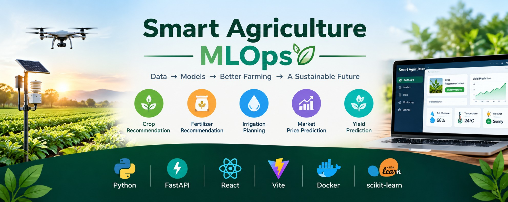

# 🌱 Smart Agriculture MLOps

**Machine Learning, FastAPI, React, and MLOps practices**

An end-to-end smart agriculture platform that uses Machine Learning, FastAPI, React, Docker, and MLOps practices to provide intelligent agricultural predictions and recommendations.



---

## 🚀 Features

- 🌾 Crop Recommendation
- 🧪 Fertilizer Recommendation
- 💧 Irrigation Prediction
- 💰 Agricultural Price Prediction
- 🌱 Crop Yield Prediction
- 🌦️ Live Weather Information
- 🤖 Machine Learning Model Training and Inference
- ⚡ FastAPI Backend
- ⚛️ React + Vite Frontend
- 🐳 Docker and Docker Compose
- 🔄 GitHub Actions CI/CD
- 📦 Git LFS for Machine Learning Models

---

## 🏗️ Tech Stack

### Machine Learning

- Python
- Scikit-learn
- Pandas
- NumPy
- Joblib

### Backend

- FastAPI
- Uvicorn
- Python

### Frontend

- React
- Vite
- JavaScript
- npm

### MLOps & DevOps

- Docker
- Docker Compose
- GitHub Actions
- Git
- GitHub
- Git LFS

### APIs

- OpenWeatherMap API

---

## 📁 Project Structure

```text
Smart-Agriculture-MLOps/
│
├── .github/
│   └── workflows/
│
├── backend/
│   ├── app/
│   │   ├── models/
│   │   ├── routes/
│   │   └── ...
│   ├── requirements.txt
│   └── ...
│
├── data/
│
├── frontend/
│   ├── src/
│   ├── public/
│   ├── package.json
│   └── ...
│
├── ml/
│   ├── training/
│   ├── notebooks/
│   └── ...
│
├── docs/
│   └── images/
│       └── smart-agriculture-github-social-preview.jpg
│
├── .gitattributes
├── .gitignore
├── docker-compose.yml
├── README.md
└── package-lock.json

⚙️ Requirements
- Python 3.x
- Node.js
- npm
- Docker Desktop
- Git
- Git LFS